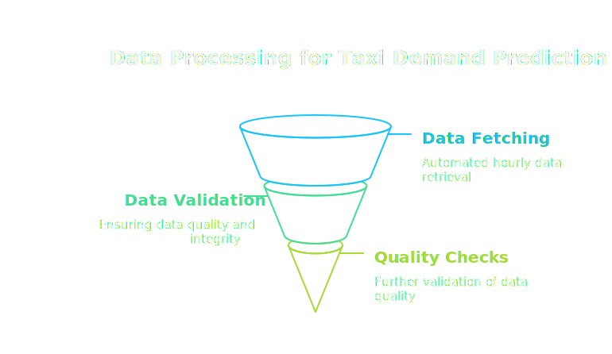

# NYC Taxi Demand Predictor 🚖

## Project Overview

An end-to-end machine learning system that predicts taxi demand in New York City on an hourly basis. This project demonstrates the implementation of a production-grade machine learning pipeline, from data ingestion to automated predictions.


### Business Problem

Taxi drivers and ride-sharing services face a common challenge: determining where and when their services will be most needed. This project addresses this challenge by:
- Predicting hourly taxi demand across NYC
- Providing automated, up-to-date predictions
- Enabling data-driven decision making for taxi fleet optimization

### Key Features 🌟

- **Automated ML Pipeline**
  - Hourly feature computation and prediction updates
  - Robust error handling and monitoring
  - Automated model retraining when performance degrades

- **Production-Grade Architecture**
  - Feature Store integration using Hopsworks
  - Modular, maintainable codebase
  - Automated CI/CD pipeline using GitHub Actions

- **Advanced Analytics**
  - Time series feature engineering
  - Hyperparameter-tuned LightGBM model
  - Comprehensive performance monitoring


## Technical Architecture 🏗️

### Data Pipeline


1. **Data Ingestion**
   - Source: NYC Taxi & Limousine Commission API
   - Automated hourly data fetching
   - Data validation and quality checks

2. **Feature Engineering**

   ```python
   # Example of feature computation
   def compute_time_features(df):
       df['hour'] = df.index.hour
       df['day_of_week'] = df.index.dayofweek
       df['month'] = df.index.month
       return df
   ```

3. **Feature Store Integration**
   - Hopsworks Feature Store for reliable feature management
   - Feature versioning and tracking
   - Online/offline feature consistency

### Model Development 🤖


#### Feature Engineering Pipeline
- Temporal features (hour, day, week, month)
- Rolling window statistics (mean, std, max, min)
- Lag features (1h, 24h, 168h)
- Holiday and event indicators

```python
# Example of complex feature generation
def generate_lag_features(df, lag_hours=[1, 24, 168]):
    for lag in lag_hours:
        df[f'demand_lag_{lag}h'] = df['demand'].shift(lag)
    return df
```

#### Model Selection Process


1. **Baseline Models Evaluated:**
   - Simple Moving Average
   - Linear Regression
   - XGBoost
   - LightGBM (**Selected**)

2. **Final Model: LightGBM**
   - Superior performance on time series data
   - Efficient handling of large datasets

```python
# Model configuration
model_params = {
    bagging_fraction=0.4024835862099092,
    features_fraction=0.22410165390918682,
    min_child_samples=73,
    num_leaves=53
}
```

#### Performance Metrics
- MAE: 2.5916

## Installation and Setup 💻

### Prerequisites
```bash
conda create -p venv python=3.12.9
conda acitvate venv
pip install -r requirements.txt
```

### Hopsworks Setup
1. Create account at [Hopsworks](https://www.hopsworks.ai/)
2. Set up environment variables:
```bash
export HOPSWORKS_API_KEY='your-api-key'
```

### Running the Project
1. **Feature Pipeline**
```bash
python feature_pipeline.py --start-date 2024-01-01
```

2. **Training Pipeline**
```bash
python training_pipeline.py --features-version v1
```

3. **Frontend**
```bash
streamlit run frontend.py
```

## Development Process and Insights 🔍

### Notebook Workflow
1. **Data Analysis** (01-04)
   - Identified data quality issues
   - Temporal patterns analysis
   - Feature correlation studies

2. **Model Development** (06-10)
   ---
   ``` - Measured in Mean Absolute Error (MAE)```

   - Baseline mode => 3.72
   - XGBoost improvement => 2.8196
   - LightGBM optimization => 2.6238
   - Feature engineering impact on LGBM=> 2.5916

3. **Pipeline Development** (11-13)
   - Feature store integration
   - Automated retraining logic
   - Performance monitoring

### Key Technical Decisions

1. **Why LightGBM?**
   - Better handling of temporal data
   - Faster training time
   - Lower memory usage

2. **Why Feature Store?**
   - Robust feature versioning
   - Online/offline feature consistency
   - Built-in monitoring
   - Easy integration with ML pipelines

3. **Automated Pipeline Design**
   - GitHub Actions for reliability
   - Error handling and notifications
   - Performance monitoring and alerts

## Future Improvements 🚀

1. **Technical Enhancements**
   - Real-time prediction capabilities
   - A/B testing infrastructure
   - Model explainability dashboard
   - Advanced feature selection

2. **Business Features**
   - Demand visualization
   - Driver allocation optimization
   - Revenue impact analysis
   - Pricing optimization integration

## Contributing 🤝

Contributions are welcome! Please follow these steps:

1. Fork the repository
2. Create a feature branch (`git checkout -b feature/AmazingFeature`)
3. Commit changes (`git commit -m 'Add AmazingFeature'`)
4. Push to branch (`git push origin feature/AmazingFeature`)
5. Open a Pull Request

## Contact 📫

pervela.karthikeya@gmail.com


## Acknowledgments 🙏

- NYC Taxi & Limousine Commission for the dataset
- Hopsworks team for feature store capabilities
